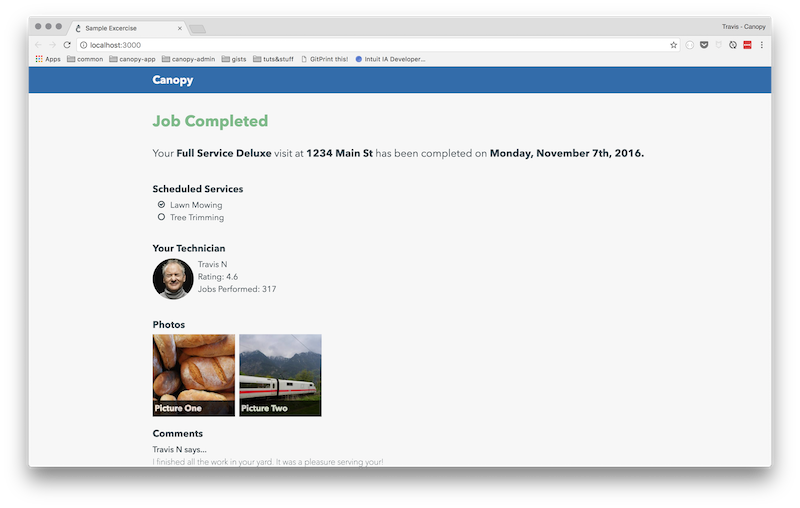

# Canopy Sample Exercise

This project is a sample exercise designed for you to show us what you got! We are providing a minimally functional application with a [backlog of user stories listed below](#user-stories). **Pick a couple stories from the list below and show us what you can do!**



## Table of Contents

- [Getting Started](#getting-started)
  - [Requirements](#requirements)
  - [Installation](#installation)
  - [Running](#running)
  - [Development](#development)
- [User Stories](#user-stories)
- [Redux Help](#redux-help)

## Getting Started

### Requirements

- node >= 6
- npm >= 3

### Installation

- duplicate this repository (do not fork)

    - first create a new repo under your github account named `canopy-sample`

    - bare clone original sample

    ```sh
    git clone --bare https://github.com/packpurchase/sample.git
    ```

    - push mirrored version to your new repo

    ```sh
    cd sample
    git push --mirror https://github.com/<yourusername>/canopy-sample.git
    ```

    - remove bare clone

    ```sh
    cd ..
    rm -rf sample
    ```

    - pull down your new repo

    ```sh
    git clone git@github.com:<yourusername>/canopy-sample.git
    ```

- install dependencies

```sh
npm install
```

### Running

While developing I usually have two processes running in the terminal:

- a dev server to watch, recompile, and serve

```sh
npm start
```

- a process to watch and run tests on changes

```sh
npm test
```

More details about these and other available scripts can be found [here](https://github.com/facebookincubator/create-react-app).

### Development

Pick out the features you would like to work on from [the list below](#user-stories), implement the given story in a feature branch and submit as a pull request against your own master branch. I would prefer a separate pull request for each story you picked to work.

## User Stories

Before diving into the stories below, a couple notes for your consideration:

- don't worry about a persistence layer... to keep things simple, let's ignore data persistence, update the data state according to actions in the UI, but don't worry about trying to make it persist beyond a page refresh.

- don't worry about authentication... let's just assume that an authenticated admin is viewing the page

- Feel free to install any deps, but I would like you to stick with and build on the **react + redux** framework we are using in this project ... it is okay if you have never worked within **react + redux** in the past ... I think most of the following stories are simple enough cases in terms of data flow and I will include some resources at the bottom of this file.

- I've rated the below stories in terms of points `[1,2,4]` where 1 is the easiest and 4 is the most difficult. This is only according to my own evaluation of the difficulties of the tasks. Your opinions may differ. I am simply providing for your reference.

- Try to pick a couple stories from the list below that showcase your strengths, but also a variety of skills. Our ideal candidate will eventually be able to work across our entire application stack even if they have particular strengths in certain areas. This really is full-stack work (check out my language breakdown from the last week!)


- okay, okay ... on to the stories!

### Only allow completion of scheduled services

**Points:** 1 (easy), **Focus:** data-flow

Currently, the interface toggles the completion status (indicated by check mark) of a scheduled service. Admins agree that this led to errors and decided it would reduce those errors if the interface only allowed a non-completed item to be set as completed, but not be allowed to update from complete to incomplete.

### Edit tech comment

**Points:** 2 (med), **Focus:** data-flow

As an admin, I would like to be able to edit a technicians comment in order to correct typos or override any questionable content should it arise. When I click on a tech comment I would like to be able to edit the comment body and set the text to whatever new value I choose. Note that I do not want customer comments to be edit-able.

### Add ability to tag any comments

**Points:** 4 (hard), **Focus:** data-flow, styling

As an admin, it would be great if we could add an arbitrary tag to a given comment. For instance, I may want to add a `flag` tag to a comment that requires action from the service team. Or `tech-review` for a tag I want to relay to the technician to get their feedback. Feel free to implement however you see fit.

### Delete comment

**Points:** 1 (easy), **Focus:** data-flow

As an admin, I would like to be able to delete technician comments as needed. For instance, look at **Travis N's** last comment. That one should probably be deleted. Again, it would be preferred if only comments from the technicians were allowed to be deleted.

### Replace Canopy branding in top-bar

**Points:** 2 (med ... hard for me :smile:), **Focus:** styling

The existing branding (really just text on a background), looks a little bland, and *a little too much like* Facebook to boot! As a customer, I would like to be a bit more inspired by the presentation of this page. See what you can do to give the branding a bit of a face-lift. No parameters really. Get creative! *But simple can be good too!*

### Overhaul styling of entire page

**Points:** 4 (hard), **Focus:** styling

Similar to the last story (you should probably only do one of these because of the overlapping scope), go wild and give the entire page a face-lift. Get creative and see what you can come up with!

### Better differentiation between customer and technician comments

**Points:** 2 (med), **Focus:** styling

As a customer or admin, when I look at the comment stream at the bottom of the page, it is easy to mix up who is talking to who. Adjust the styling so that we get a clearer picture of when the comment is a technician commenting to a customer, or when it is a customer commenting to the technician / service team. This can be as simple or as complex as you think it needs to be in order to better visually convey that meaning.

## Redux Help

Don't worry if you are unfamiliar with **redux**, there are some concepts that may be new, especially if you've never used **React** or some kind of **React-inspired** framework. I've found [official Redux docs](http://redux.js.org) to be extremely helpful. I would recommend reading through the entire [Basics Section](http://redux.js.org/docs/basics/) to get an idea of how data flows through the framework. You can also take a look at code in this **sample project**. Before you add any of the features listed [above](#user-stories), there is really only one piece of data that is updated. When the **scheduled services** are clicked the completed state is toggled. You can take a look at the behavior in the interface and reference it back to the following relevant files:

- [containers/ScheduledItems](./src/containers/ScheduledItems.js)
- [components/ScheduledItem](./src/components/ScheduledItem.js)
- [actions/index](./src/actions/index.js)
- [reducers/scheduledItems](./src/reducers/scheduledItems.js)

Feel free to contact me with any questions.
